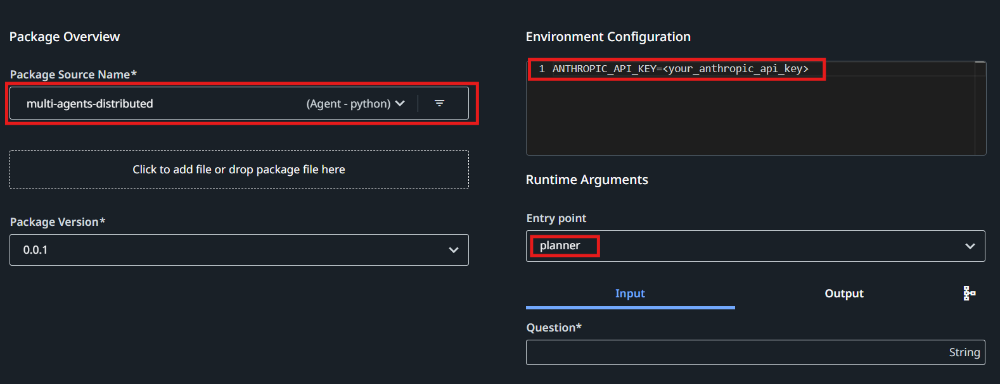
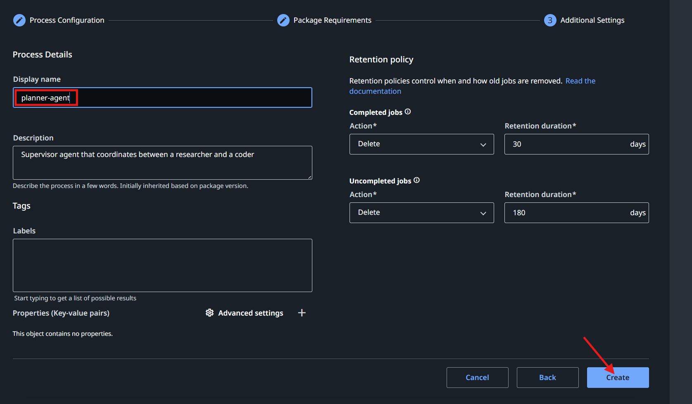
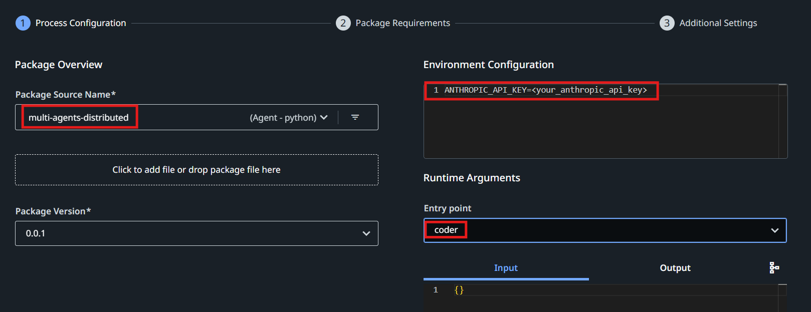
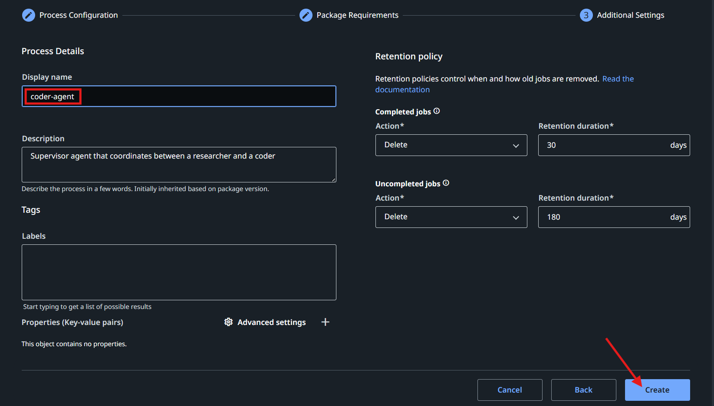

# Multi-Agent Task Execution System

This repository implements a multi-agent system that decomposes complex tasks into discrete steps, routing them to specialized agents for execution. The system comprises three main components:

1. **Planner Agent**: Orchestrates the workflow by planning task execution and routing subtasks to worker agents.
2. **Researcher Agent**: Gathers information, formulas, and reference materials without performing calculations.
3. **Coder Agent**: Executes calculations and evaluates formulas with specific values.

Each agent operates as an independent entry point and can be deployed as a separate process, while still being packaged together as part of an Orchestrator Agent Package.

## System Architecture

The system utilizes LangGraph to create a directed graph of agents that can communicate and share state.

### Planner Agent Graph
```mermaid
---
config:
  flowchart:
    curve: linear
---
graph TD;
	__start__(<p>__start__</p>)
	input(input)
	create_plan(create_plan)
	supervisor([supervisor]):::last
	invoke_agent(invoke_agent)
	__start__ --> input;
	create_plan --> supervisor;
	input --> supervisor;
	invoke_agent --> supervisor;
	classDef default fill:#f2f0ff,line-height:1.2
	classDef first fill-opacity:0
	classDef last fill:#bfb6fc
```

### Researcher Agent Graph
```mermaid
---
config:
  flowchart:
    curve: linear
---
graph TD;
	__start__([<p>__start__</p>]):::first
	__end__([<p>__end__</p>]):::last
	__start__ --> researcher___start__;
	researcher___end__ --> __end__;
	subgraph researcher
	researcher___start__(<p>__start__</p>)
	researcher_agent(agent)
	researcher_tools(tools)
	researcher___end__(<p>__end__</p>)
	researcher___start__ --> researcher_agent;
	researcher_tools --> researcher_agent;
	researcher_agent -.-> researcher_tools;
	researcher_agent -.-> researcher___end__;
	end
	classDef default fill:#f2f0ff,line-height:1.2
	classDef first fill-opacity:0
	classDef last fill:#bfb6fc
```

### Coder Agent Graph
```mermaid
---
config:
  flowchart:
    curve: linear
---
graph TD;
	__start__([<p>__start__</p>]):::first
	__end__([<p>__end__</p>]):::last
	__start__ --> coder___start__;
	coder___end__ --> __end__;
	subgraph coder
	coder___start__(<p>__start__</p>)
	coder_agent(agent)
	coder_tools(tools)
	coder___end__(<p>__end__</p>)
	coder___start__ --> coder_agent;
	coder_tools --> coder_agent;
	coder_agent -.-> coder_tools;
	coder_agent -.-> coder___end__;
	end
	classDef default fill:#f2f0ff,line-height:1.2
	classDef first fill-opacity:0
	classDef last fill:#bfb6fc
```

## Agent Responsibilities

- **Planner Agent**:
  - Takes user questions and formulates execution plans.
  - Routes tasks to appropriate worker agents.
  - Manages execution flow and state tracking.
  - Returns final results to the user.

- **Researcher Agent**:
  - Retrieves information using a Tavily search tool.
  - Provides factual content, definitions, and formulas.
  - Does not perform calculations (strictly enforced).

- **Coder Agent**:
  - Executes calculations using Python code.
  - Evaluates formulas with specific input values.
  - Returns precise numerical results.

## Usage

### Running the System

To run the entire system, use the following command with the complete JSON input:

```bash
uipath run planner '{"question": "First, please state the Pythagorean theorem. Give only the formula, using variables a, b, and c. Then apply this formula to calculate the value when a=2 and b=3."}'
```

### Debugging Individual Agents

You can debug individual agents by invoking them directly:

#### Researcher Agent
Run the researcher agent with:

```bash
uipath run researcher '{"messages":[{"content":"State the Pythagorean theorem formula using variables a, b, and c","type":"human"}]}'
```

#### Coder Agent
Run the coder agent with:

```bash
uipath run coder '{"messages":[{"content":"Let me help you state the Pythagorean theorem formula. The Pythagorean theorem is a fundamental mathematical formula that describes the relationship between the sides of a right triangle.\n\nThe formula is:\n\na² + b² = c²\n\nWhere:\n- a and b are the lengths of the two legs (the sides adjacent to the right angle)\n- c is the length of the hypotenuse (the longest side, opposite to the right angle).","type":"human","name":"researcher-agent"},{"content":"Calculate the result using the formula when a=2 and b=3","type":"human"}]}'
```

## Sample Workflow

1. User submits a question about the Pythagorean theorem.
2. Planner creates an execution plan with two steps:
   - Step 1: Researcher agent retrieves the Pythagorean theorem formula.
   - Step 2: Coder agent applies the formula to calculate the result for a=2, b=3.
3. Planner executes Step 1 by invoking the researcher agent.
4. Researcher agent returns the formula a² + b² = c².
5. Planner executes Step 2 by invoking the coder agent.
6. Coder agent calculates c = √(2² + 3²) = √(4 + 9) = √13 ≈ 3.606.
7. Planner combines the responses and returns the final answer to the user.

## Steps to Execute Project on UiPath Cloud Platform

1. **Clone the Repository**
   ```bash
   git clone https://github.com/UiPath/uipath-langchain-python.git
   ```

2. **Navigate to the Sample Directory**
   - **Windows:**
     ```bash
     cd .\uipath-langchain-python\samples\multi-agent-planner-researcher-coder-distributed
     ```

   - **Unix-like Systems (Linux, macOS):**
     ```bash
     cd ./uipath-langchain-python/samples/multi-agent-planner-researcher-coder-distributed
     ```

3. **Create and Activate a Virtual Python Environment**
   ```bash
   pip install uv
   uv venv -p 3.11 .venv
   .venv\Scripts\activate  # Windows
   source .venv/bin/activate  # Unix-like Systems
   uv sync
   ```

4. **Authenticate with UiPath Cloud Platform**
   ```bash
   uipath auth
   ```
   > **Note:** After successful authentication in the browser, select the tenant for publishing the agent package.
   ```
   Received log data
   Received authentication information
   Available tenants:
     0: cosmin
     1: DefaultTenant
     2: Demo
     3: lucian
     4: Solutions
     5: SolutionsTest
     6: Test
     7: TestRoles
   Select tenant: 2
   ```

5. **Package and Publish Agents**
   ```bash
   uipath pack
   uipath publish
   ```
   > **Note:** You will need to select the feed for publishing:
   ```
   Select feed type:
     0: Tenant package feed
     1: Personal workspace
   Select feed: 0
   ```

6. **Create Agent Processes in Orchestrator**
   - **Planner Agent**
     
     

   - **Researcher Agent**
     
     

   - **Coder Agent**
     
     

   > **Note:** Ensure that the display names for the coder and researcher agent processes are *coder-agent* and *researcher-agent*.

7. **Run the Planner Agent with Any Input Question**
   > **Tip:** For a five-step action plan, consider using the following input:
   ```
   Could you find a Python solution for the N-Queens puzzle for N=8? Please analyze why this solution works,
   considering the key programming concepts it employs.
   Then, revise the solution to handle a dynamic value of N, where N is any positive integer.
   After that, research the time and space complexity of this new solution.
   Lastly, demonstrate this revised Python solution with N=10.
   ```

## Implementation Details

The system is implemented using:

- LangGraph for agent orchestration
- LangChain for agent creation and tool integration
- Claude 3.5 Sonnet for LLM capabilities
- Tavily for search functionality in the researcher agent
- Python REPL for code execution in the coder agent

## Requirements

- Python 3.10+
- LangGraph
- LangChain
- Anthropic API key
- Tavily API key
